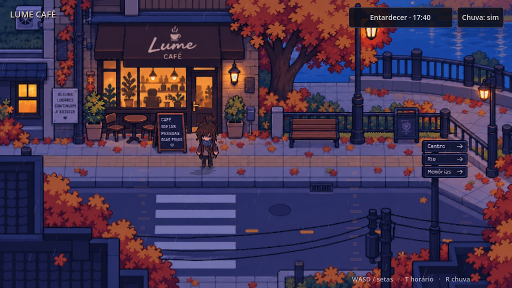

# MYU — Lume Café · Godot

[Jogar no navegador](https://joaobruck.github.io/Myu/godot/) · [Projeto e controles](godot/README.md)

Movimento em oito direções, colisão nos pés, animações, sombra projetada e profundidade dos objetos. **17:40 é a identidade visual**: entardecer frio e luzes quentes do café. Chuva automática, sem relógio ou seletores na tela.

**WASD/setas** para andar. Perto da cadeira externa, **E** para sentar e **E/Esc** para levantar. **Espaço** revela a fala inteira. No celular, use o analógico e os botões **Sentar/Levantar**. **F3** mostra as colisões.

A pausa no café tem pose sentada e retrato originais, com um balão de pensamento. Placas com letras corrigidas e transparência suave dos objetos que encobrem a protagonista melhoram a leitura do cenário.

[Prévia da caminhada lateral no Godot](docs/lume-walk.mp4)

---

# MYU

## Build estável
https://joaobruck.github.io/Myu/

## Godot 4.7.2 — versão jogável Web
https://joaobruck.github.io/Myu/godot/

No celular, jogue em modo paisagem e use o analógico virtual no canto inferior esquerdo.

## Outdoor Engine Lab v3 — Phaser 4
https://joaobruck.github.io/Myu/phaser/

Rota alternativa:
https://joaobruck.github.io/Myu/streetlab/

### Godot
- viewport lógico: **1024×576**;
- cenário do Lume Café em pixel art;
- protagonista em **32×56 por frame**, no jogo;
- **idle frontal com 4 frames**, preservando a direção nas demais paradas;
- caminhada animada com **6 frames** para baixo, cima, direita e esquerda;
- movimento em 8 direções;
- teclado no desktop e analógico por toque no celular;
- hitbox concentrada nos pés;
- chuva automática, com transições suaves e pausas;
- export Web sem threads para maior compatibilidade mobile;
- build validado pelo Godot 4.7.2 antes do deploy.

### Phaser v3
- velocidade máxima: **50 px/s**;
- prédio com corpos estáticos Matter contínuos;
- colisão determinística adicional antes do deslocamento;
- personagem não pode sair do polígono caminhável;
- fallback `lastSafe` impede desaparecer do mapa;
- hitbox concentrada nos pés;
- obstáculos visíveis sólidos.
